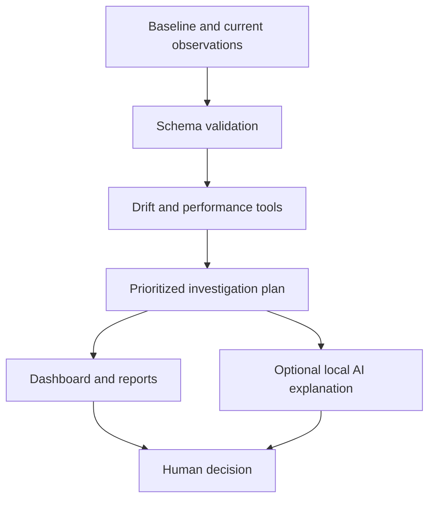

# MLOps Reliability Agent

An evidence-based monitoring assistant by **Joseph Arayemi / GIIT Africa**. It compares reference and current model observations, detects threshold breaches, and builds a prioritized investigation plan.

**Working portfolio MVP:** deterministic monitoring tools plus an optional local AI explanation adapter. Includes three synthetic scenarios, a browser dashboard, CLI reporting and automated tests. Supports **numeric features and binary classification**. No cloud account, package installation or API key is needed for the core demo.

## Start on Windows

1. Download the repository ZIP and choose **Extract All**.
2. Open the extracted project folder in Terminal or PowerShell.
3. Run:

```powershell
py server.py
```

4. Open **http://127.0.0.1:8081** in your browser.
5. Click **Explore degraded-model demo**. The sample produces six investigation items.

On macOS/Linux, or where `py` is unavailable, use `python server.py` or `python3 server.py`. Requires Python 3.11+. To stop, press Ctrl+C.

## What it does

- Compares numeric feature distributions with reference-derived histograms and total variation distance.
- Separately identifies increased missing values.
- Calculates accuracy, precision, recall, F1, confusion matrices and labelled-pair coverage.
- Detects accuracy and recall declines using configurable thresholds.
- Checks nearest-rank P95 inference latency and observed error rates.
- Marks unavailable or undersampled checks as unknown, including missing labels.
- Ranks findings and provides specific investigation recommendations.
- Exports JSON/Markdown reports and records an execution trace and input SHA-256.
- Optionally explains findings using a locally configured Ollama model.

## Try the three scenarios

Import a file from `examples/` in the dashboard:

| File | Expected result |
|---|---|
| `healthy.json` | Within thresholds; no investigation items |
| `degraded.json` | Action required; accuracy 75%, recall 50%; six investigation items |
| `unlabelled.json` | Insufficient evidence; accuracy/recall checks cannot be concluded |

Every example uses synthetic data for 120 reference and 120 current requests. The perfect reference predictions are deliberately simple for transparent demonstration, not an expected production benchmark.

## Command line

```bash
python agent.py examples/degraded.json --output report.json --markdown report.md
python -m unittest discover -s tests -v
```

An alert is a valid analysis result, so the CLI exits successfully after producing a report. Invalid input returns a nonzero exit code. CI tests behavior, not production health.

## Your data contract

Supply one JSON object containing `model`, `features`, `baseline` and `current`. Both windows must represent comparable inference populations for the same feature definitions and model/version. Window selection, deduplication, model provenance and label maturity are your responsibility; this MVP does not validate timestamps or unique event identifiers.

```json
{
  "model": "fraud-classifier:v1",
  "features": ["amount", "account_age_days"],
  "thresholds": {"minimum_samples": 30, "accuracy_drop": 0.05},
  "baseline": [
    {"features": {"amount": 120.0, "account_age_days": 300},
     "prediction": 1, "actual": 1, "latency_ms": 90, "error": false}
  ],
  "current": [
    {"features": {"amount": 650.0, "account_age_days": null},
     "prediction": 0, "actual": 1, "latency_ms": 720, "error": false}
  ]
}
```

This tiny schema example yields insufficient evidence; use the full sample files for meaningful checks. Features must be finite numbers, missing keys or null. Predictions and actual labels must be integer 0/1 or null/omitted. Labelled metrics use only rows with both fields. Missing values are excluded from histogram comparisons but included in missingness rates. Latency is nonnegative milliseconds; error is true/false/null. Error rate and latency use their own observed sample counts, not all rows. Sparse operational observations may be biased; inspect the exported counts.

The dashboard limits imports to 5 MB. The engine limits each window to 20,000 rows and the feature list to 100 names. Use `local-data/` for private inputs; it is gitignored. Never commit real customer observations or credentials.

## Thresholds and interpretation

| Setting | Default | Interpretation |
|---|---:|---|
| `minimum_samples` | 30 | Minimum observations per evaluated window/metric |
| `drift_tv` | 0.25 | Total variation alert threshold, range 0–1 |
| `accuracy_drop` | 0.05 | Absolute baseline-minus-current drop (5 percentage points) |
| `recall_drop` | 0.10 | Absolute recall drop (10 percentage points) |
| `missing_rate_increase` | 0.10 | Absolute increase in missing feature values |
| `p95_latency_ms` | 500 | Current P95 latency alert boundary |
| `error_rate` | 0.05 | Current observed error-rate alert boundary |
| `minimum_label_coverage` | 0.8 | Minimum labelled-pair fraction for both windows |

Alerts trigger at or above the boundary. Recall also requires at least `minimum_samples` positive ground-truth labels in both windows. An undefined precision/recall/F1 value is represented as null, not zero.

TV is half the sum of absolute frequency differences over shared bins. Bins use ten equal-width intervals from the reference minimum to maximum, plus underflow/overflow bins. A constant reference uses three bins: below/equal/above. Values at the reference maximum remain in the last interior bin. TV=0 means identical binned distributions; TV=1 means disjoint bins. Small within-bin shifts can be missed, and a shifted feature does not establish reduced model quality or concept drift. These thresholds are illustrative heuristics; calibrate them for your application. No significance tests or uncertainty intervals are implemented.

Overall status precedence: critical finding → `action_required`; warning → `investigate`; unknown-only findings → `insufficient_evidence`; otherwise `within_thresholds`. Unknown checks remain visible even when a higher-priority alert exists. An all-clear result covers only implemented checks, not fairness, calibration, security or overall model safety.

## Optional local AI advisor

The monitoring checks and investigation plans work without an LLM. To enable AI explanations, run Ollama, install a model appropriate for your hardware, and set its exact model name:

```powershell
$env:OLLAMA_MODEL="your-installed-model-name"
py server.py
```

On macOS/Linux: `OLLAMA_MODEL=your-installed-model-name python server.py`.

The adapter sends the computed report and your question to `http://127.0.0.1:11434/api/chat`. It does not send raw observation rows. Model and feature identifiers may still be sensitive. Select a local model if reports must remain on your machine and verify your Ollama configuration. The dashboard revalidates and recomputes the assessment before submitting advisor context.

The AI adapter is mock-tested, not live-model validated in this release. Generated advice is untrusted and must be checked against cited check IDs. The model has no action tools, cannot change monitoring scores and cannot retrain or roll back anything. Prompt instructions treat report fields as data; this does not guarantee resistance to prompt injection. Provider failures appear as errors rather than fabricated answers.

## Architecture



## Validation performed

All 16 unit tests passed on Python 3.12, along with HTTP checks for assets, health, assessment, invalid inputs, origin rejection and content type. JavaScript syntax was checked. Interactive browser verification could not run because the Chromium download timed out in the build environment. The GitHub Actions matrix is configured but has not run until this repository is published.

## Deployment scope

The server binds to loopback only. It is a local development application, with no authentication, database, scheduler or cloud connectors. Do not expose it as an internet service. Requests are processed in memory; files are saved when explicitly exported. The report hash aids traceability but is not a tamper-proof audit trail.

Next milestones: authenticated deployment; AWS SageMaker/Azure ML observation adapters; scheduled collection; persistent incident history; subgroup analysis; human-reviewed retraining proposals; evaluations of AI-generated explanations. None is claimed as implemented.

## Repository setup

Suggested repository: `mlops-reliability-agent`. Create it empty, then from this folder:

```bash
git init -b main
git add .
git commit -m "Build MLOps reliability monitoring MVP"
git remote add origin https://github.com/josepharayemi-netizen/mlops-reliability-agent.git
git push -u origin main
```

GitHub Actions runs the standard-library tests and sample report generation on Python 3.11, 3.12 and 3.13. License: MIT.
